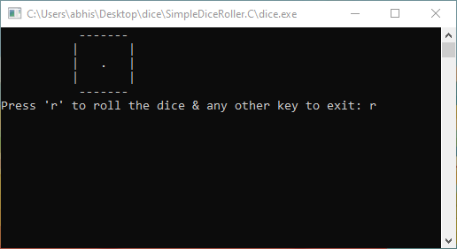
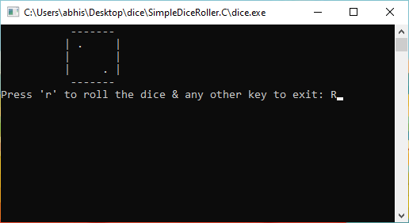
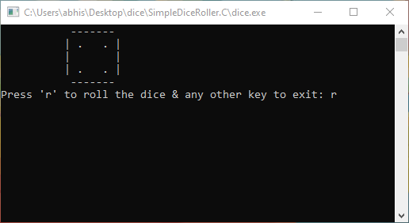
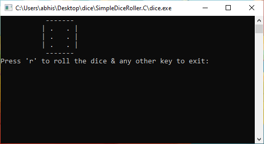

### 🎲 Simple Dice Roller

Welcome to **Simple Dice Roller** – your ultimate companion for a virtual dice-rolling experience! This lightweight and efficient C program generates a random number between 1 and 6 and displays the corresponding dice face. Perfect for board games or just for fun!

## 🌟 Features

- 🔢 **Random Dice Roll**: Generates a random number between 1 and 6.
- 🎲 **Dice Face Display**: Visual representation of the dice face.
- 🔁 **Continuous Rolling**: Press 'r' or 'R' to roll again.
- 🚪 **Easy Exit**: Press any other key to exit.
- 💻 **Precompiled Executable**: Includes a ready-to-use `dice.exe` for quick execution on Windows.
## 💻 System Requirements (Windows)

To run this program on Windows, ensure that you have the following:

- **Operating System**: Windows 7 or later
- **Compiler**: GCC (GNU Compiler Collection) or any C compiler compatible with your Windows version

Ensure that your system meets these requirements to compile and run the program successfully on Windows.

## 🚀 How to Use
### 📱 Run Online with Google Cloud Shell

You can also run the program directly online using Google Cloud Shell:

[](https://console.cloud.google.com/cloudshell/editor?cloudshell_git_repo=https://github.com/Abhishek88788/SimpleDiceRoller.git&cloudshell_open_in_editor=dice_roller.c)

Click the button above to launch Google Cloud Shell and start using the program right away!


### 🪟 Windows

#### Using Precompiled Executable

1. **Download the `dice.exe` file** from the repository.
2. **Run `dice.exe`** by double-clicking it.
3. Follow the on-screen instructions to roll the dice.
### 📥 Download

If you prefer not to compile the program from source, you can download the precompiled executable for Windows:

- [Download dice.exe](https://github.com/yourusername/SimpleDiceRoller/raw/main/dice.exe)

Simply download the `dice.exe` file and run it on your Windows system to start using the program.
#### Compiling from Source

1. **Clone the repository:**
    ```bash
    git clone https://github.com/Abhishek88788/SimpleDiceRoller.git
    ```
2. **Navigate to the project directory:**
    ```bash
    cd SimpleDiceRoller
    ```
3. **Compile the program:**
    ```bash
    gcc -o dice_roller dice_roller.c
    ```
4. **Run the executable:**
    ```bash
    dice_roller
    ```


## 📊 Example Output
       -------
      | .   . |
      |   .   |
      | .   . |
       -------


## 📸 Screenshots

### Dice Faces

 
 
 
 
 



## 🤝 Contribution

Feel free to fork this repository, add new features, or fix bugs. Pull requests are welcome!


## 📜 License

This project is open-source and available under the MIT License.


